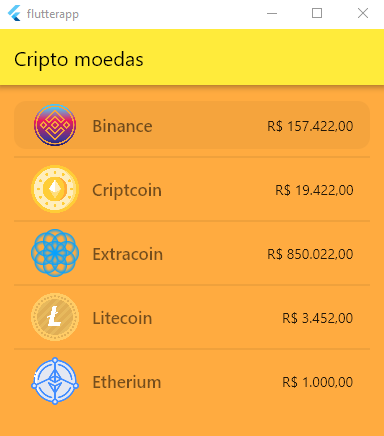

# Indice

- [Sobre](#-sobre)
- [Tecnologias Utilizadas](#-tecnologias-utilizadas)
- [Criando o projeto](#-criando-o-projeto)

## 🔖 Sobre

O projeto desenvolvido é um app que simula as informações de Cripto Moedas em tempo real.


<p align="center">
  <kbd>
    
  </kbd>
  &nbsp;&nbsp;&nbsp;&nbsp;
</p>

## 🚀 Tecnologias utilizadas

O projeto foi desenvolvido utilizando as seguintes tecnologias

- [Flutter](https://flutter.dev/)
- [Flaticon](https://www.flaticon.com/)

## 🗂 Criando o projeto

```bash


    # Criar o repositório
    Abra o Visual Studio Code, e abra a paleta de comandos (Ctrl + Shift + P) e digite: Flutter: New Project
  
    # Iniciar o projeto
    Aperte F5 para iniciar a depuração do projeto 
  ```
  ---
    
    🚀 Desenvolvido por Luís Henrique.
